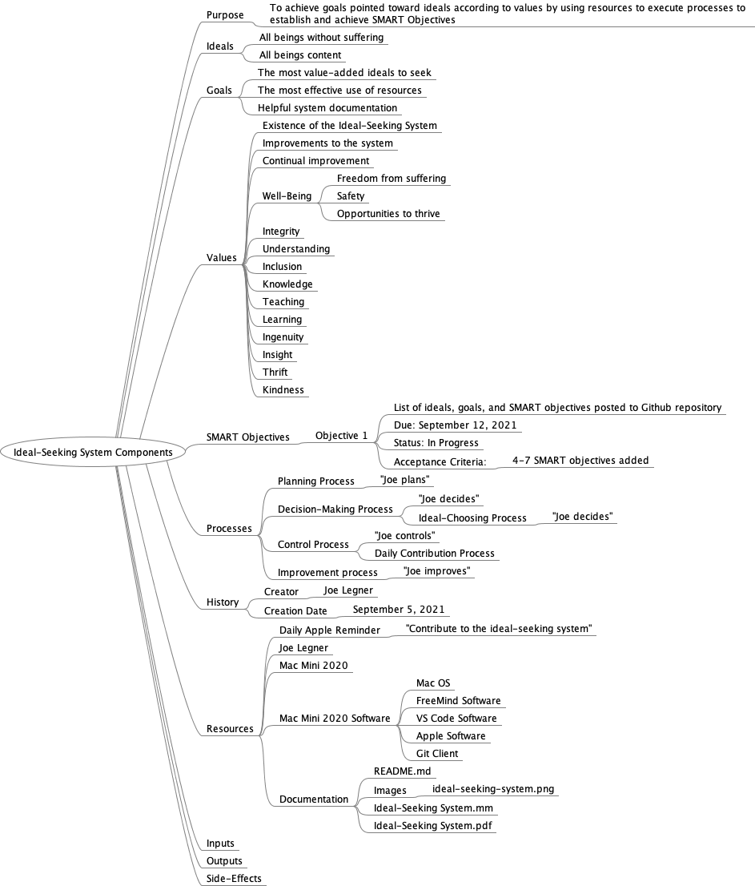

# Ideal-Seeking System

## Purpose

The purpose of the Ideal-Seeking System is to set [Goals] pointed to a set of [Ideals] according to stated [Values] by using [Resources] to execute [Processes] to establish and achieve [SMART Objectives].

## Ideals

Ideals are aspirations that are never going to be achieved.

1. All beings free from suffering.
1. All beings content.

The first one might be considered primary. The second one is to mitigate against the risk of the system developing into the equivalent of the Marvel supervillian Thanatos, but not stopping with one-half of beings.

## Goals

Goals are long-term without strict acceptance criteria.

See **Mind Map** for a list of goals.

## Objectives

Each objective has a due date less than 1 year away. Anything longer than that should be re-categorized as a goal or split into smaller objectives that will not take more than a year to achieve.

See **Mind Map** for a list of objectives.

## Creator

Joe Legner, Valrico, Florida

## History

September 5, 2021
: Initial Commit

## Resources

### Human Resources

- Joe Legner, the creator of the Ideal Seeking System.

### Documentation

In addition to this `README.md` and `LICENSE` files, there is a mind map of the system, available in several formats.



### File Repository

[`https://github.com/joelegner/ideal-seeking-system`](https://github.com/joelegner/ideal-seeking-system)

## Inputs

- Labor of Joe Legner.

## Processes

### Anki Cards Export Process


## Outputs

- Documentation
- Resources

## License

Refer to the separate `LICENSE` file.

## Appendix A: Outline from Mind Map

```
Ideal-Seeking System Components
    Purpose
        To achieve goals pointed toward ideals according to values by using resources to execute processes to establish and achieve SMART Objectives
    Ideals
        All beings without suffering
        All beings content
    Goals
        The most value-added ideals to seek
        The most effective use of resources
        Helpful system documentation
    Values
        Existence of the Ideal-Seeking System
        Improvements to the system
        Continual improvement
        Well-Being
            Freedom from suffering
            Safety
            Opportunities to thrive
        Integrity
        Understanding
        Inclusion
        Knowledge
        Teaching
        Learning
        Ingenuity
        Insight
        Thrift
        Kindness
    SMART Objectives
        Objective 1
            List of ideals, goals, and SMART objectives posted to Github repository
            Due: September 12, 2021
            Status: In Progress
            Acceptance Criteria:
                4-7 SMART objectives added
    Processes
        Planning Process
            "Joe plans"
        Decision-Making Process
            "Joe decides"
            Ideal-Choosing Process
                "Joe decides"
        Control Process
            "Joe controls"
            Daily Contribution Process
        Improvement process
            "Joe improves"
    History
        Creator
            Joe Legner
        Creation Date
            September 5, 2021
    Resources
        Daily Apple Reminder
            "Contribute to the ideal-seeking system"
        Joe Legner
        Mac Mini 2020
        Mac Mini 2020 Software
            Mac OS
            FreeMind Software
            VS Code Software
            Apple Software
            Git Client
        Documentation
            README.md
            Images
                ideal-seeking-system.png
            Ideal-Seeking System.mm
            Ideal-Seeking System.pdf
    Inputs
    Outputs
    Side-Effects
```